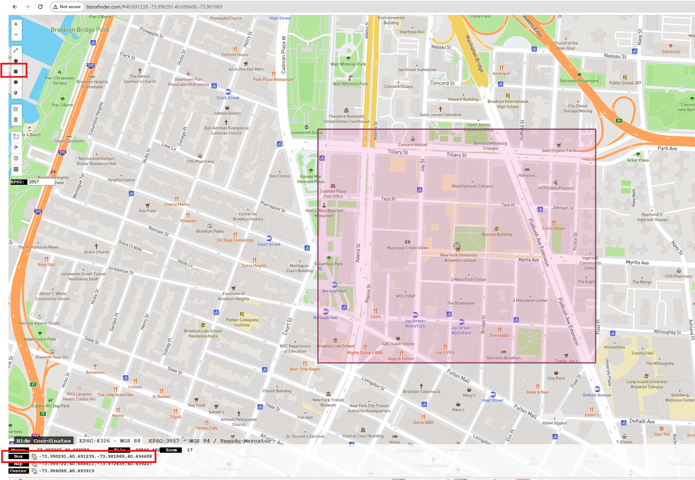

# Demo of the Geo2SigMap Package

The [Geo2SigMap](https://github.com/functions-lab/geo2sigmap) package is a powerful new package developed by [Tingjun Chen's lab](https://functions-lab.github.io/)
at Duke University that enables users to generate 3D models for arbitary geographic regions.  These 3D models can be directly used by Sionna.
In this demo, we will show how to use the package to create a simple 3D model of the area of the NYU Tandon campus in Brooklyn, NY.

## Installation
Follow the instructions [Geo2SigMap github page](https://github.com/functions-lab/geo2sigmap?tab=readme-ov-file#installation) to install the package.
You may wish to install this package in a virtual environment to avoid conflicts with other packages.

## Select a Bounding Box
The first step in creating a 3D model is to select a bounding box that defines the geographic region of interest.  The bounding box is defined by the
latitude and longitude of the lower left and upper right corners of the box.  You can find the bounding box, by going to the [bounding finder website](https://bboxfinder.com/).
A screenshot of the bounding box for the NYU Tandon campus is shown below:



To select the bounding box:
* Zoom into the area of interest.  
* Then select the rectangle tool on the left side of the scrreen to draw a rectangle around the area of interest.
* The region will be highlighted.  The bounding box coordinates will be displayed in the lower left corner of the screen.
* Copy the coordinates to use in the next step.

## Create the 3D model
Once you have the bounding box coordinates, you can create the 3D model using the following code as follows:
```bash
	scenegen bbox -73.990291 40.691239 -73.981869 40.696608 --data-dir nyu_tandon
```
This command will create a 3D model of the NYU Tandon campus and save the output files in the `nyu_tandon` directory. 
In this example, the area is `719m x 605m` and it generates the 3D model in a few seconds.


