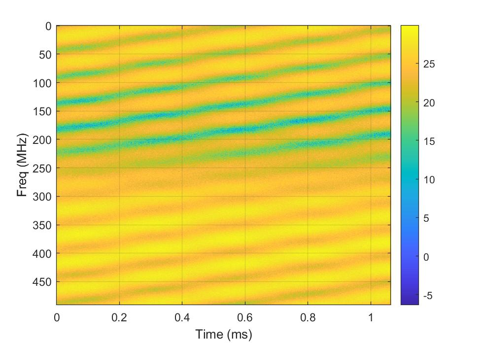

# SDR and MATLAB Lab:  Simulating and Measuring 5G Multi-Path Fading Channels

In most environments,  wireless channels consist of multiple paths due to various
propagation mechanisms such as diffraction, reflections and scattering.
Paths of similar delay combine with time-varying gains due to Doppler spread
within each path cluster.  In this lab, we show how to model, simulate and
measure these multi-path channels.  For measuring the channel, we will build
a simple channel sounder  -- a basic device for measuring channel response
between a TX and RX.  The digital communications class covered a simpler
version of the channel sounder with a static channel.

In doing this lab, you will learn to:

* Describe cluster-delay line (CDL) models
* Get parameters for 5G CDL models using the  5G MATLAB toolbox
* Represent antenna orientations using global and local frames of reference.
* Compute directional gains on paths from the angles
* Simulate multi-path fading channels with directive antennas
* Perform simple time-frequency channel sounding
* Implement the channel sounding experiments on a simple USRP

## Files
The lab has the following files:

* `multiPathLab.mlx`: Main file to run the lab
* `ChanSounder.m`:  A class for performing the TX and RX functions of the channel sounder
* `SIMOMPChan.m`:  A class for emulating the multi-path channel for a single-input single-output (i.e., one antenna)
* `ElemWithAxes.m`:  A class for modeling the orientation of the antenna elements

